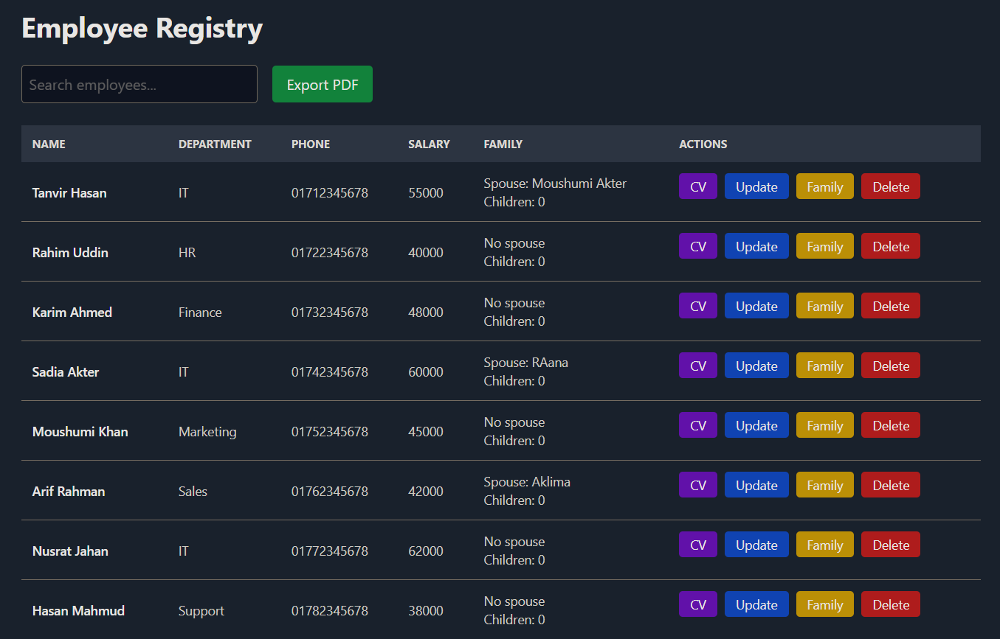
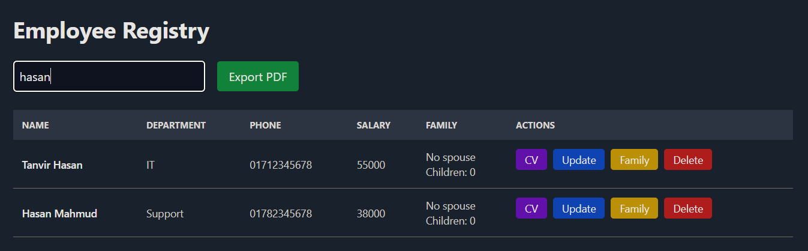
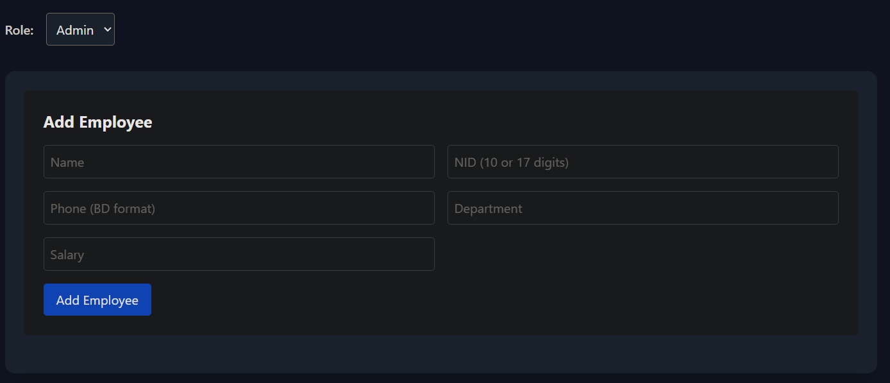
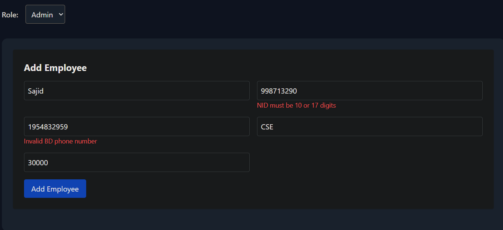
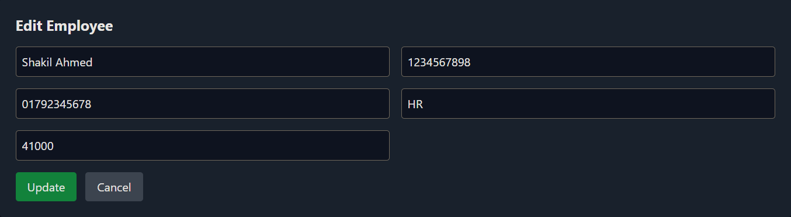
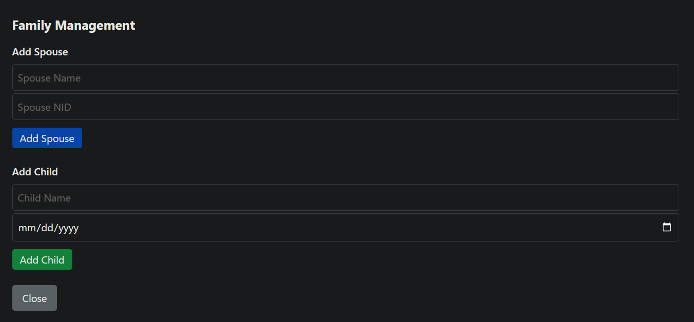
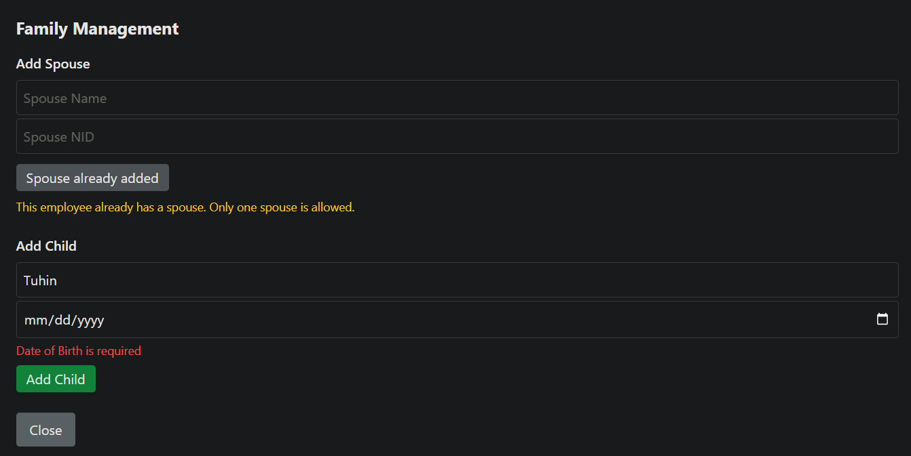
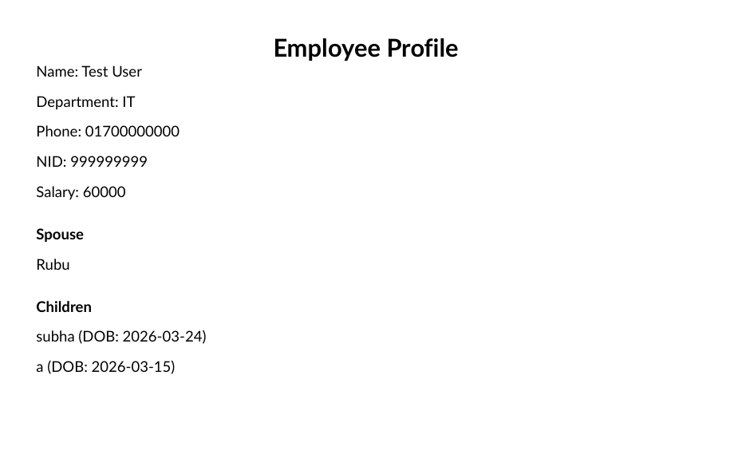
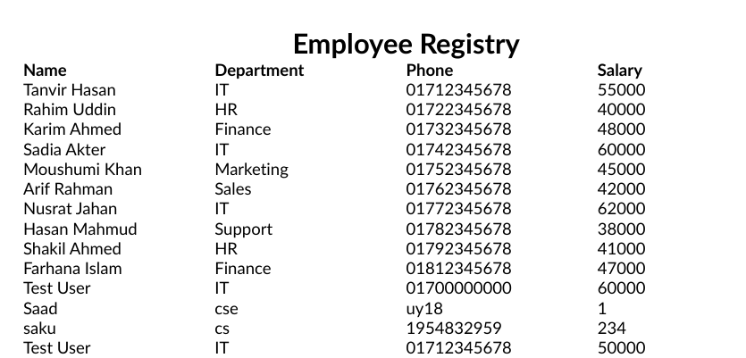

# Employee & Family Registry System

A full-stack **Employee Management System** developed as part of the **.NET Developer Technical Assessment for Fionetix Solutions**.

This application manages employee records along with their family relationships, provides fast search capabilities, and supports PDF reporting for employee data.

The system is designed specifically for the **Bangladesh context**, including validation for Bangladeshi NID numbers and phone formats.

---

# Technology Stack

## Backend

- .NET 10 Web API
- Entity Framework Core
- PostgreSQL
- FluentValidation
- QuestPDF (PDF generation)

## Frontend

- React (Vite)
- Tailwind CSS
- Axios

## Architecture

The application follows a **layered architecture** with clear separation of concerns:

- Controllers → API endpoints
- Services → Business logic
- Entities → Database models
- Data → Database context and migrations
- Validators → Input validation rules

---

# Key Features

## Employee Management

The system supports complete **CRUD operations** for employee records.

Each employee contains the following information:

- Name
- NID (10 or 17 digits)
- Phone number (Bangladesh format)
- Department
- Basic Salary

Employees can be:

- Created
- Updated
- Deleted
- Viewed in a searchable list

---

## Family Relationship Management

Each employee may contain family members.

### Spouse

Each employee can have **one spouse**.

Fields:

- Name
- NID

Validation:

- Only one spouse per employee

### Children

Each employee can have **multiple children**.

Fields:

- Name
- Date of Birth

---

## Global Employee Search

The application contains a **single global search field** that filters employees by:

- Name
- NID
- Department

Search functionality includes:

- Case-insensitive filtering
- Debounced API calls (~400ms delay)
- Optimized frontend performance

---

## PDF Reporting

The system provides two PDF export features.

### Employee Table Export

Exports the **currently filtered employee list** into a PDF table.

This allows quick generation of reports for filtered results.

### Employee CV Export

Generates a detailed **employee CV-style PDF** including:

- Employee information
- Spouse details
- Children details

---

## Role-Based Access

The system includes two user roles.

### Admin

Admin users can:

- Create employees
- Update employee records
- Delete employees
- Manage spouse and children data

### Viewer

Viewer users have **read-only access**.

They can:

- View employee records
- Search employees
- Export PDF reports

---

# Database Design

The system uses **PostgreSQL** with **Entity Framework Core**.

Three main entities are used.

---

## Employee

Fields:

- Id
- Name
- NID
- Phone
- Department
- BasicSalary

Relationships:

- One-to-One → Spouse
- One-to-Many → Children

---

## Spouse

Fields:

- Id
- Name
- NID
- EmployeeId (Foreign Key)

Rules:

- Each employee can have **only one spouse**

---

## Child

Fields:

- Id
- Name
- DateOfBirth
- EmployeeId (Foreign Key)

Rules:

- One employee may have **multiple children**

---

# Project Structure
```text
employee-family-registry
│
├── backend (ASP.NET Core API)
│   ├── Controllers
│   ├── Data
│   ├── Entities
│   ├── Services
│   └── Migrations
│
├── frontend (React UI)
│   ├── components
│   ├── pages
│   ├── services
│
├── SRS_Document.pdf
└── README.md
```

---
## Screenshots

### Employee Registry Dashboard
Shows the main employee table with search, actions, and family overview.



---

### Global Search (Debounced)
Search employees by name or other attributes.



---

### Add Employee Form
Create a new employee with validation for NID, phone number, and salary.



---

### Employee Form Validation
Client-side validation for NID format and Bangladesh phone number.



---

### Edit Employee
Update employee information such as department, phone, or salary.



---

### Family Management
Add spouse (one-to-one relationship) and children (one-to-many relationship).



---

### Family Validation
Prevents adding more than one spouse and validates child information.



---

### Employee Profile PDF (CV Export)
Export a detailed PDF profile for an individual employee.



---

### Employee Registry PDF Export
Generate a full PDF report of the employee registry.


---

# Database Setup (PostgreSQL)

Install **PostgreSQL** locally and create a new database.

Example database name:

```
employee_registry
```

Update the connection string inside the backend configuration file:

```
backend/appsettings.json
```

Example configuration:

```json
"ConnectionStrings": {
  "DefaultConnection": "Host=localhost;Database=employee_registry;Username=postgres;Password=postgres"
}
```

---

# Run Database Migrations

Navigate to the **backend project directory** and run the following command:

```
dotnet ef database update
```

This command will automatically create the required database tables using **Entity Framework Core migrations**.

---

# Seed Data

The application automatically seeds the database with **10 initial employee records** during the first run.

These records include realistic Bangladeshi employee names such as:

- Tanvir Hasan  
- Rahim Uddin  
- Karim Ahmed  
- Sadia Akter  
- Moushumi Khan  
- Arif Rahman  
- Nusrat Jahan  
- Hasan Mahmud  
- Shakil Ahmed  
- Farhana Islam  

The seeded data helps demonstrate:

- Employee listing
- Family relationships
- Search functionality
- PDF export capabilities

---

# Running the Backend

Navigate to the backend directory:

```
cd backend
```

Run the backend API:

```
dotnet run
```

The API server will start at:

```
https://localhost:5026
```

Swagger API documentation will be available at:

```
https://localhost:5026/swagger
```

Swagger allows you to:

- Test API endpoints
- Inspect request/response models
- Validate backend functionality

---

# Running the Frontend

Navigate to the frontend directory:

```
cd frontend
```

Install dependencies:

```
npm install
```

Start the development server:

```
npm run dev
```

The frontend application will run at:

```
http://localhost:5173
```

The React interface communicates with the **.NET Web API backend** through REST endpoints.

---

# API Endpoints

## Employee Endpoints

Retrieve all employees:

```
GET /api/Employee
```

Create a new employee:

```
POST /api/Employee
```

Update an employee:

```
PUT /api/Employee/{id}
```

Delete an employee:

```
DELETE /api/Employee/{id}
```

---

## Global Search

Search employees by **Name, NID, or Department**:

```
GET /api/Employee/search?query=
```

Features:

- Case-insensitive search
- Debounced requests (≈400ms delay)
- Fast filtering for large datasets

---

## Family Relationship Endpoints

Add spouse:

```
POST /api/Employee/{id}/spouse
```

Add child:

```
POST /api/Employee/{id}/children
```

These endpoints allow managing family relationships connected to each employee.

---

## PDF Export Endpoints

Export filtered employee list as PDF:

```
GET /api/Employee/export/pdf
```

Export individual employee CV:

```
GET /api/Employee/{id}/export/cv
```

The generated CV PDF includes:

- Employee information
- Spouse information
- Children information

---

# Validation Rules

The system implements several validation rules to ensure data integrity.

### Employee Validation

- NID must be **unique**
- NID must be **10 or 17 digits**
- Phone number must follow **Bangladesh format**
- Phone must start with **+880 or 01**

### Family Validation

- Each employee can have **only one spouse**
- Spouse NID must be **unique**
- Child records must include **Name and Date of Birth**

### Salary Handling

- Basic salary defaults to **0 if not provided**

Validation is implemented using **FluentValidation and backend validation logic**.

---

# Documentation

The repository also contains a **System Requirements Specification (SRS) document** describing the architecture and system design.

File included in the repository:

```
SRS_Document.pdf
```

The document includes:

- System Scope
- Entity Relationship Diagram (ERD)
- Edge Cases
- Assumptions
- System architecture overview

---

# Author

**Sajidur Rahman Sajid**

Submission for: **Fionetix Solutions**  
.NET Developer Technical Assessment
