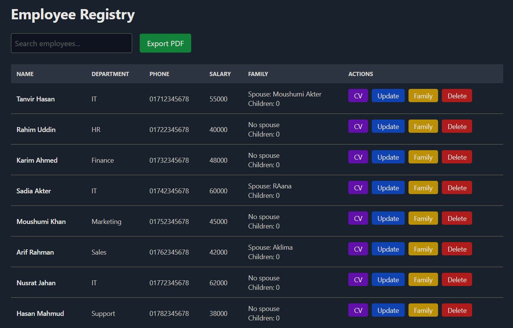
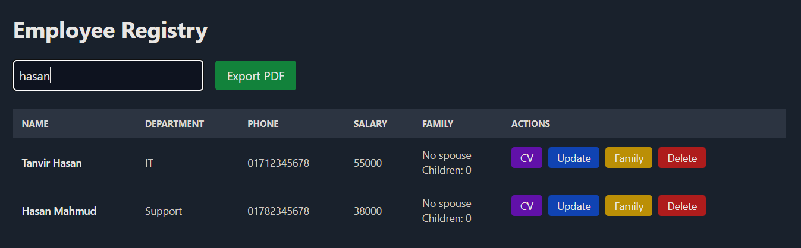
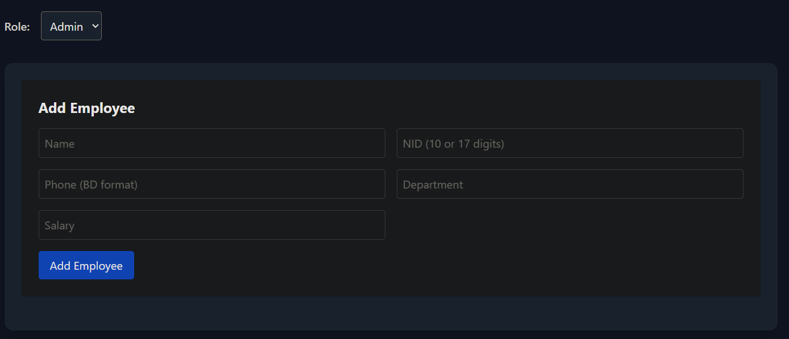
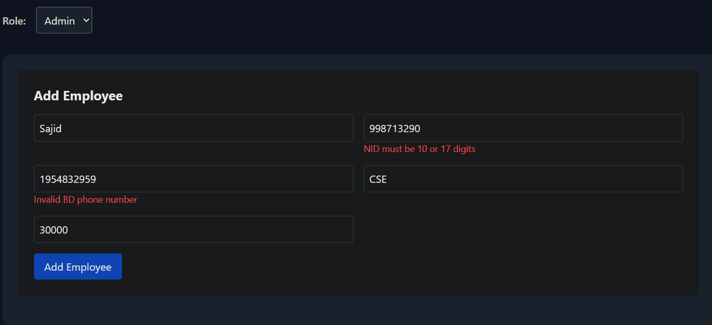
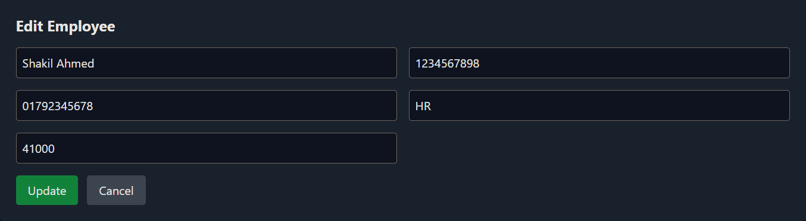
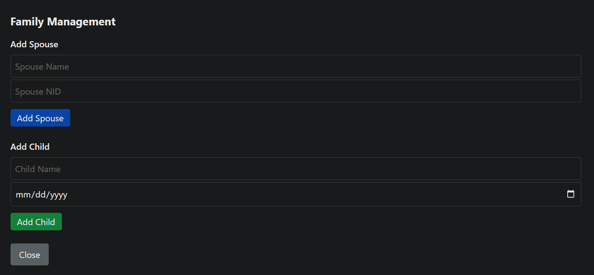
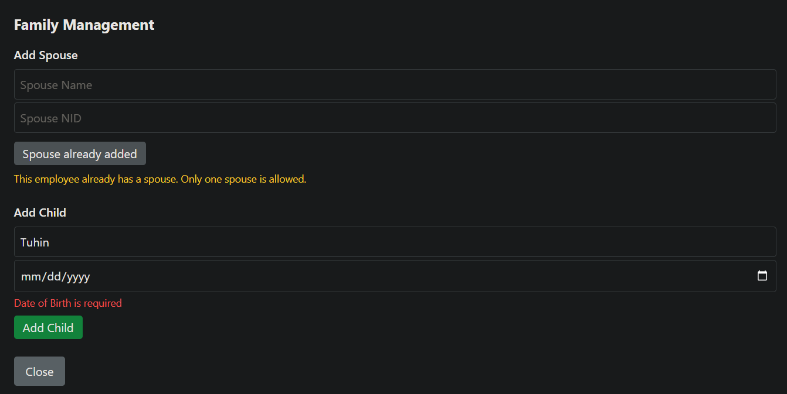
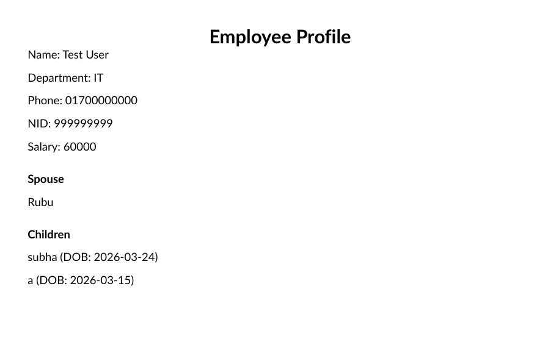
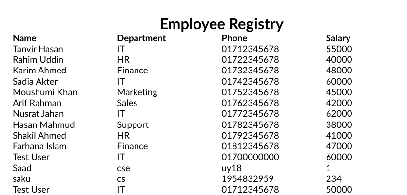

# Employee & Family Registry System

<p align="center">


</p>

A full-stack **Employee Management System** built with **ASP.NET Core**, **React**, and **PostgreSQL**.

The application streamlines employee record management by supporting family relationships, advanced search capabilities, PDF report generation, and an Admin / Viewer role toggle in the UI (not yet enforced server-side). It demonstrates modern full-stack development practices including layered architecture, RESTful APIs, backend validation, and responsive frontend design.

The system also includes validation tailored for Bangladeshi employee information, including National ID (NID) numbers and phone number formats.

---

# Technology Stack

| Category | Technologies |
|-----------|--------------|
| Backend | ASP.NET Core (.NET 10), Entity Framework Core |
| Frontend | React (Vite), Tailwind CSS, Axios |
| Database | PostgreSQL |
| Validation | FluentValidation |
| PDF Generation | QuestPDF |
| Architecture | Layered Architecture, REST API |

---

# Key Features

## Employee Management

The system supports complete CRUD operations for employee records.

Each employee includes:

- Name
- National ID (NID)
- Phone Number
- Department
- Basic Salary

Supported operations:

- Create
- Read
- Update
- Delete
- Search

---

## Family Relationship Management

Each employee can manage associated family members.

### Spouse

Each employee may have one spouse.

Fields:

- Name
- National ID (NID)

Validation:

- One spouse per employee

---

### Children

Each employee may have multiple children.

Fields:

- Name
- Date of Birth

---

## Global Employee Search

Search employees by:

- Name
- National ID
- Department

Features:

- Case-insensitive search
- Debounced API requests
- Fast filtering
- Optimized frontend performance

---

## PDF Reporting

Generate professional PDF reports.

### Employee Registry Report

Export the currently filtered employee list.

### Employee Profile Report

Generate an individual employee profile including:

- Employee details
- Spouse information
- Children information

---

## Role-Based Access (UI level)

> Roles are switched in the frontend; the API does not yet enforce them (no server-side authorization).

### Administrator

Administrators can:

- Create employees
- Update employee information
- Delete employees
- Manage spouse information
- Manage child information
- Export reports

---

### Viewer

Viewers can:

- Browse employees
- Search employee records
- Export PDF reports

---

# Database Design

The application uses **PostgreSQL** with **Entity Framework Core**.

### Employee

Fields:

- Id
- Name
- NID
- Phone
- Department
- BasicSalary

Relationships:

- One-to-One → Spouse
- One-to-Many → Children

---

### Spouse

Fields:

- Id
- Name
- NID
- EmployeeId

Rule:

- One spouse per employee

---

### Child

Fields:

- Id
- Name
- DateOfBirth
- EmployeeId

Rule:

- Multiple children per employee

---

# Project Structure

```text
employee-family-registry
│
├── backend
│   ├── Controllers
│   ├── Data
│   ├── Entities
│   ├── Services
│   ├── Validators
│   └── Migrations
│
├── frontend
│   ├── components
│   ├── pages
│   ├── services
│   └── assets
│
├── SRS_Document.pdf
└── README.md
```

---

# Screenshots

## Employee Registry Dashboard

Main employee management interface.



---

## Global Search

Search employees by name, NID, or department.



---

## Add Employee

Create employee records with validation.



---

## Employee Validation

Validation for NID, phone number, and salary.



---

## Edit Employee

Update employee information.



---

## Family Management

Manage spouse and children relationships.



---

## Family Validation

Relationship validation and business rules.



---

## Employee Profile PDF

Individual employee profile export.



---

## Employee Registry PDF

Generate registry reports.



---

# Getting Started

## Clone Repository

```bash
git clone https://github.com/Saji-d/employee-family-registry.git
```

---

## Configure PostgreSQL

Create a PostgreSQL database.

Example:

```
employee_registry
```

Update the connection string inside:

```
backend/appsettings.json
```

Example:

```json
"ConnectionStrings": {
  "DefaultConnection": "Host=localhost;Database=employee_registry;Username=postgres;Password=postgres"
}
```

---

## Apply Database Migrations

Navigate to the backend directory.

```bash
cd backend
```

Run:

```bash
dotnet ef database update
```

The required tables will be created automatically.

---

## Sample Data

The application automatically seeds the database with sample employee records during the first run, allowing the core functionality to be explored immediately without manual data entry.

---

## Run Backend

```bash
cd backend
dotnet run
```

Backend:

```
https://localhost:5026
```

Swagger:

```
https://localhost:5026/swagger
```

---

## Run Frontend

```bash
cd frontend
npm install
npm run dev
```

Frontend:

```
http://localhost:5173
```

---

# REST API Overview

## Employee

```http
GET    /api/Employee
POST   /api/Employee
PUT    /api/Employee/{id}
DELETE /api/Employee/{id}
```

---

## Search

```http
GET /api/Employee/search?query=
```

Supports searching by:

- Name
- NID
- Department

---

## Family

```http
POST /api/Employee/{id}/spouse
POST /api/Employee/{id}/children
```

---

## PDF Export

```http
GET /api/Employee/export/pdf
GET /api/Employee/{id}/export/cv
```

---

# Validation Rules

## Employee

- Unique National ID
- Valid 10 or 17-digit NID
- Bangladesh phone number validation
- Required employee information

---

## Family

- One spouse per employee
- Unique spouse NID
- Required child information

---

## Salary

- Defaults to 0 if not provided

---

# Learning Outcomes

This project demonstrates practical experience with:

- ASP.NET Core Web API
- React + Vite
- PostgreSQL
- Entity Framework Core
- Layered Architecture
- RESTful API Design
- CRUD Operations
- FluentValidation
- QuestPDF
- Role-based UI (Admin / Viewer)
- Full-Stack Application Development

---

# Documentation

The repository also includes a Software Requirements Specification (SRS) document describing the application's architecture and design.

Topics covered include:

- Functional Requirements
- Entity Relationship Diagram (ERD)
- System Architecture
- Assumptions
- Edge Cases

---

# Author

**Sajidur Rahman Sajid**

B.Sc. in Computer Science & Engineering

American International University-Bangladesh (AIUB)
